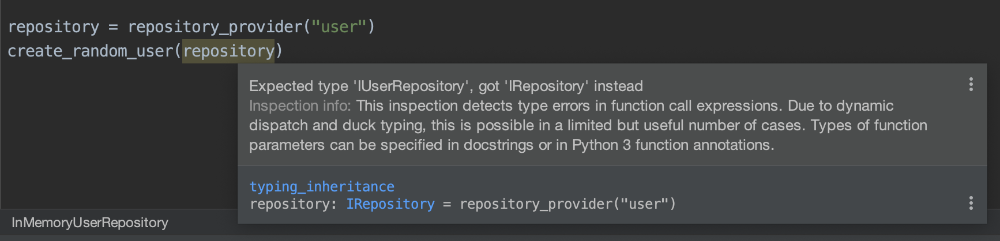

# typing-inheritance-example 👪

In [this](typing_inheritance.py) example is implemented a dummy code to represent a double inheritance.

See diagram:

It seems, Pycharm cannot resolve this and raise an specific warning.

